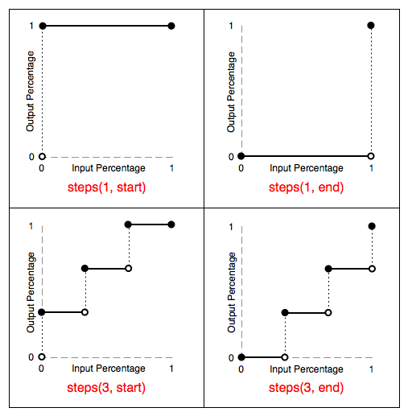

# 前端逐帧动画

实现逐帧动画需要两个条件：（1）动画帧；（2）连续播放。

## GIF 图片

### 优点:

成本较低、使用方便

### 缺点：

- 画质上，gif 支持颜色少(最大 256 色)、Alpha 透明度支持差，图像锯齿毛边比较严重
- 交互上，不能直接控制播放、暂停、播放次数，灵活性差；
- 性能上，gif 会引起页面周期性的 paint ，性能较差。

## 帧动画

帧动画的实现原理是不断切换视觉内图片内容，利用视觉滞留生理现象来实现连续播放的动画效果，下面我们来介绍制作 CSS3 帧动画的几种方案。

（1）连续切换动画图片地址 src

我们将图片放到元素的背景中（background-image），通过更改 background-image 的值实现帧的切换。但是这种方式会有以下几个缺点，所以该方案不推荐。

- 多张图片会带来多个 HTTP 请求
- 每张图片首次加载会造成图片切换时的闪烁
- 不利于文件的管理

（2）连续切换雪碧图位置

我们将所有的帧动画图片合并成一张雪碧图，通过改变 background-position 的值来实现动画帧切换


## CSS3 Animation

对 CSS3 Animation，
相信大家都不陌生了，其有八大属性：

- `animation-name`: 动画名称
- `animation-duration`: 规定完成一个周期所花费的时间
- `animation-delay`: 定义动画开始前等待的时间
- `animation-iteration-count`: 规定动画被播放的次数（默认 1)
- `animation-play-state`: 规定动画是否正在运行或停止
- `animation-fill-mode`: 规定动画结束时的状态
- `animation-timing-function`: 规定动画的速度曲线（默认是 ease）
- `animation-direction`: 规定动画是否在下一个周期逆向地播放(默认是"normal")

问题一：既然都详细定义关键帧了，是不是可以不用 steps 函数了，直接定义 linear 变化不就好了吗？

```css
#bear-img {
  width: 1600px;
  height: 200px;
  background: url("./images/bear.png") no-repeat 0 0;
}
@keyframes move {
  0% {
    background-position: 0 0;
  }
  100% {
    background-position: -1600px 0;
  }
}
#bear-linear {
  width: 200px;
  height: 200px;
  background: url("./images/bear.png") no-repeat 0 0;
  animation: move 1.5s linear infinite;
}
```

具体效果如: step-1.html 所示

animation 的工作原理是通过将元素的 CSS 样式从一个状态改变为另一个状态（我们称为线性变化）
默认情况下，它以 ease 方式（速度逐渐放慢）过渡，它会在每个关键帧之间插入补间动画，所以动画效果是连贯性的，

但有些时候，我们不需要这种过渡效果，而是想实现跳跃式的效果，这时，steps()函数就出现了.

这次我们换成小人,可以看到小人这张图一共有 20 帧。


写法一：

```css
.person {
  width: 300px;
  height: 300px;
  background-repeat: no-repeat;
  background-image: url(frame.png);
  animation: frame 333ms steps(1, end) both infinite;
}
@keyframes frame {
  0% {
    background-position: 0 0;
  }
  5% {
    background-position: -300px 0;
  }
  10% {
    background-position: -600px 0;
  }
  15% {
    background-position: -900px 0;
  }
  20% {
    background-position: -1200px 0;
  }
  25% {
    background-position: -1500px 0;
  }
  30% {
    background-position: -1800px 0;
  }
  35% {
    background-position: -2100px 0;
  }
  40% {
    background-position: -2400px 0;
  }
  45% {
    background-position: -2700px 0;
  }
  50% {
    background-position: -3000px 0;
  }
  55% {
    background-position: -3300px 0;
  }
  60% {
    background-position: -3600px 0;
  }
  65% {
    background-position: -3900px 0;
  }
  70% {
    background-position: -4200px 0;
  }
  75% {
    background-position: -4500px 0;
  }
  80% {
    background-position: -4800px 0;
  }
  85% {
    background-position: -5100px 0;
  }
  90% {
    background-position: -5400px 0;
  }
  95% {
    background-position: -5700px 0;
  }
  100% {
    background-position: -6000px 0;
  }
}
```

## animation-timing-function

CSS animation-timing-function 属性定义 CSS 动画在每一动画周期中执行的节奏。对于关键帧动画来说，timing function 作用于一个关键帧周期而非整个动画周期，即从关键帧开始开始，到关键帧结束结束。

**timing-function 作用于每两个关键帧之间，而不是整个动画。**

接着我们来了解下 steps() 函数：

- steps 函数指定了一个阶跃函数，它接受两个参数。
- 第一个参数接受一个整数值，表示两个关键帧之间分几步完成。
- 第二个参数有两个值< start > or < end >。默认值为< end > 。
- step-start 等同于 step(1, start)。step-end 等同于 step(1, end)。

```
steps(number, [start | end])
```

综上我们可以知道，因为我们详细定义了一个关键帧周期，从开始到结束，每两个关键帧之间分 1 步展示完，也就是说 0% ~ 5%之间变化一次，5% ~ 10%变化一次。

写法二：

```css
.person {
  width: 300px;
  height: 300px;
  background-repeat: no-repeat;
  background-image: url(frame.png);
  animation: frame 333ms steps(20) both infinite;
}
@keyframes frame {
  0% {
    background-position: 0 0; //可省略,可以只定义最后一帧，因为默认第一帧就是初始位置。
  }
  100% {
    background-position: -6000px 0;
  }
}
```

定义了关键帧的开始和结束，也就是定义了一个关键帧的周期，但是因为没有详细定义每一帧的展示，所以
将会在 0%-100%分 20 步来阶段性展示.

#### 横轴表示时间，纵轴表示动画完成度（也就是 0%~100%）



- 第一个图，steps(1, start)将动画分为 1 段，跳跃点为 start，也就是说动画在每个周期的起点发生阶跃（即图中的空心圆 → 实心圆）。由于只有一段，后续就不再发生动画了。

- 第二个图，steps(1, end)同样是将动画分为 1 段，但跳跃点是 end，也就是动画在每个周期的终点发生阶跃，也是图中的空心圆 → 实心圆，但注意时间，是在终点才发生动画。

- 第三个图，steps(3, start)将动画分为三段，跳跃点为 start，动画在每个周期的起点发生阶跃（即图中的空心圆 → 实心圆）。在这里，由于动画的第一次阶跃是在第一阶段的起点处（0s），所以我们看到的动画的初始状态其实已经是 1/3 的状态，因此我们看到的动画的过程为 1/3 → 2/3 → 1 。

- 第四个图，steps(3, end)也是将动画分为三段，但跳跃点为 end，动画在每个周期的终点发生阶跃（即图中的空心圆 → 实心圆）。虽然动画的状态最终会到达 100%，但是动画已经结束，所以 100%的状态是看不到的，因此我们最终看到的动画的过程是 0 → 1/3 → 2/3

那如果，在动画期间，颜色又变化，应该是如何变化呢，是到点才变化，还是到两点之间变化，还是渐变呢？

查看 step-3.html，可以看到。

## 关于移动端的应用

切换雪碧图的位置过程换成了 transform:translate3d()来实现，不过要加多一层 overflow: hidden;的容器包裹，这里我们以只定义初始和结束帧为例，使用 transform 可以开启 GPU 加速，提高机器渲染效果，还能有效解决移动端帧动画抖动的问题。

```css
<div class="sprite-wp" > <div class="sprite" > </div > </div > .sprite-wp {
  width: 300px;
  height: 300px;
  overflow: hidden;
}
.sprite {
  width: 6000px;
  height: 300px;
  will-change: transform;
  background: url(frame.png) no-repeat center;
  animation: frame 333ms steps(20) both infinite;
}
@keyframes frame {
  0% {
    transform: translate3d(0, 0, 0);
  }
  100% {
    transform: translate3d(-6000px, 0, 0);
  }
}
```
